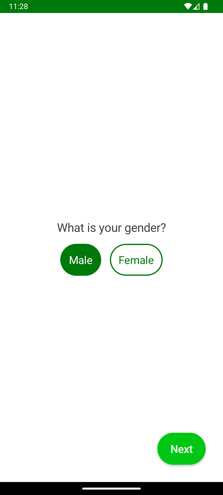
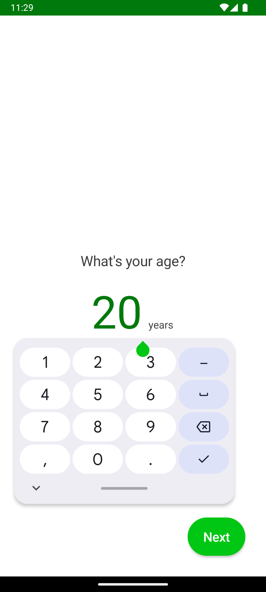
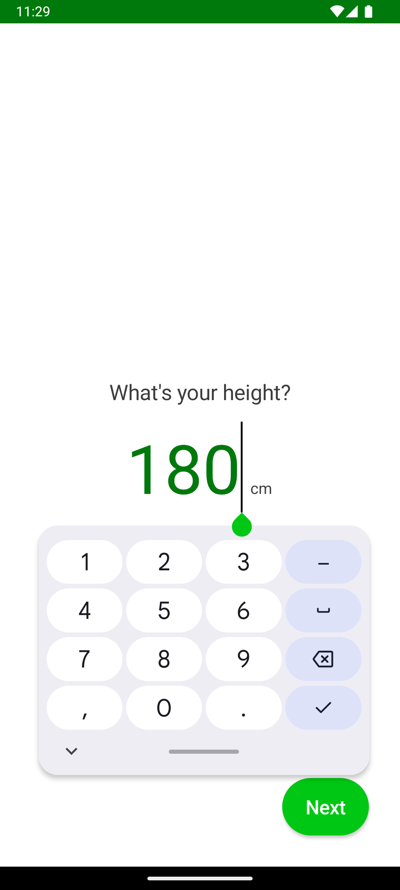
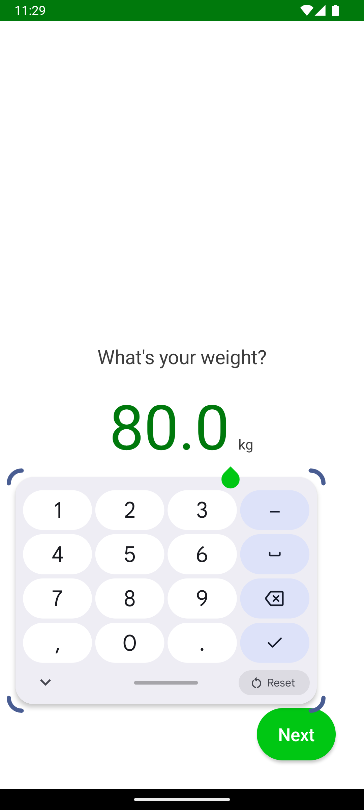
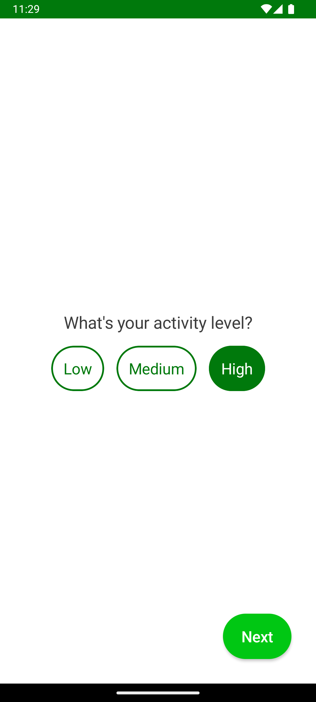
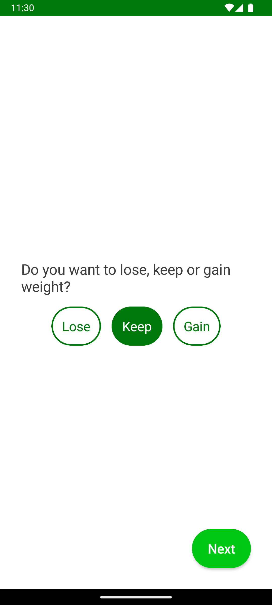
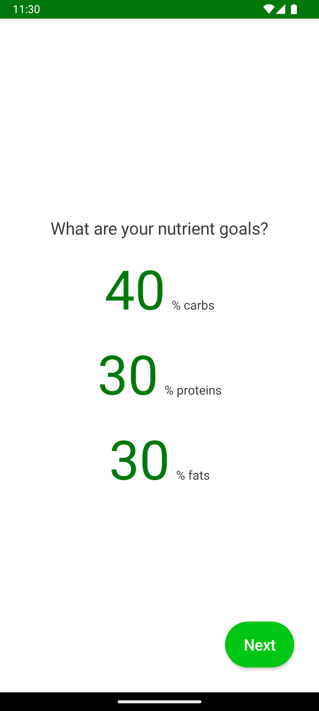
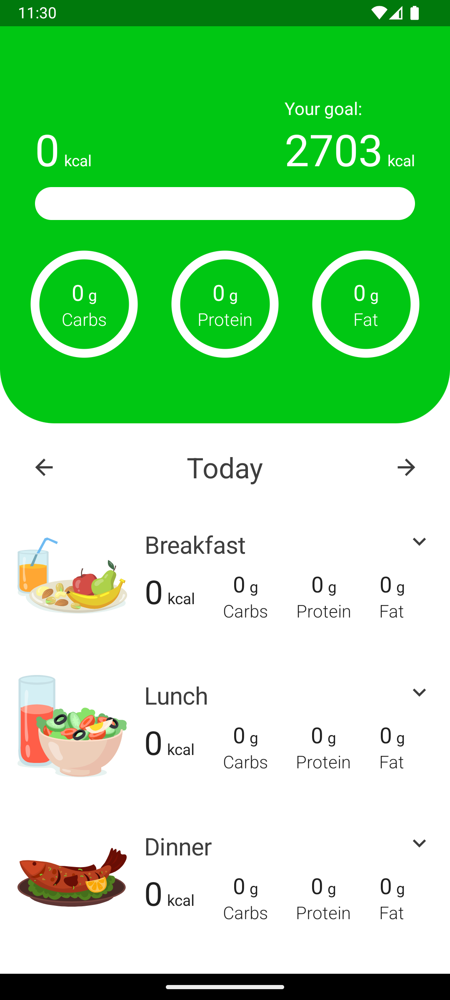
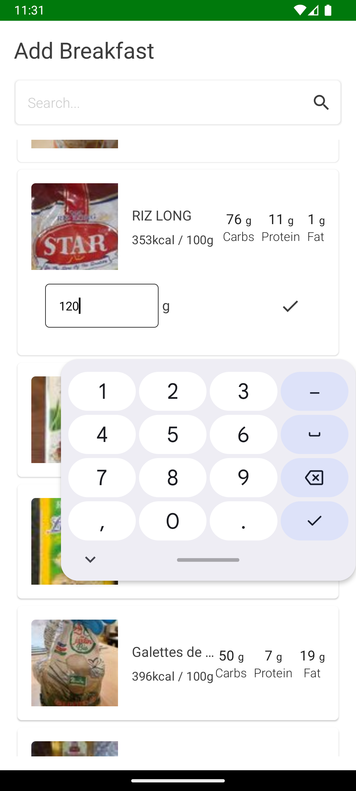

# My Calorie Tracker

A comprehensive Android application built with **multi-module architecture** and Jetpack Compose for tracking daily caloric intake and nutritional goals. This app integrates with the **Open Food Facts API** to provide accurate nutritional data and follows modern Android development practices with clean architecture and dependency injection.

## 📱 Features

- **Onboarding Flow**: Complete user setup with personalized information
- **Precise Calorie Tracking**: Calculate exact daily caloric needs based on your profile
- **Multi-Meal Support**: Track breakfast, lunch, dinner, and snacks separately
- **Food Search**: Search and add foods using the comprehensive Open Food Facts database
- **Localized Products**: Change API country settings to find local market products
- **Nutritional Goals**: Set and monitor daily nutritional targets
- **Responsive UI**: Beautiful, modern interface built with Jetpack Compose

## 🏗️ Multi-Module Architecture

The application follows **Clean Architecture** principles with a comprehensive multi-module structure for better separation of concerns, improved build times, and enhanced maintainability:

### Module Structure

- **App Module**: Main application module containing navigation and dependency injection setup
- **Core Module**: Shared utilities, domain models, and common functionality across modules
- **Core UI Module**: Shared UI components, theming, and design system
- **Onboarding Module**: Complete user onboarding flow and profile setup screens
- **Tracker Module**: Main calorie tracking functionality and meal management
- **Data Module**: Repository implementations and Open Food Facts API integration
- **Domain Module**: Business logic, use cases, and domain entities

### Key Technologies

- **Jetpack Compose**: Modern declarative UI toolkit
- **Dagger Hilt**: Dependency injection framework across all modules
- **Navigation Component**: Type-safe navigation between screens
- **Open Food Facts API**: Comprehensive food database with nutritional information
- **SharedPreferences**: Local data persistence for user settings
- **Material Design**: Google's design system implementation
- **Retrofit**: HTTP client for API communication

## 🌍 Open Food Facts Integration

The app leverages the **Open Food Facts API** to provide:

- **Comprehensive Food Database**: Access to millions of products worldwide
- **Accurate Nutritional Data**: Verified nutritional information per 100g
- **Country-Specific Products**: Configurable API country settings for local market products
- **Barcode Support**: Search products by barcode for quick addition
- **Multi-language Support**: Product information in various languages
- **Real-time Updates**: Always up-to-date product information

### Country Configuration

Users can customize their experience by selecting their country to find local products:
- European markets (France, Germany, Spain, etc.)
- North American products (USA, Canada)
- Asian markets (Japan, India, etc.)
- And many more regions supported by Open Food Facts

## 📋 Application Flow

### 1. Personalized Calorie Calculation

The app calculates your exact daily caloric needs using:
- **BMR (Basal Metabolic Rate)**: Based on age, gender, height, and weight
- **TDEE (Total Daily Energy Expenditure)**: Incorporates activity level
- **Goal Adjustment**: Modifies calories for weight loss, maintenance, or gain
- **Macro Distribution**: Calculates optimal protein, carbs, and fat ratios

### 2. Comprehensive Meal Tracking

Track your intake across four main categories:
- **Breakfast**: Start your day with proper tracking
- **Lunch**: Monitor midday nutrition
- **Dinner**: Evening meal management
- **Snacks**: Keep track of between-meal consumption

Each meal category provides:
- Individual calorie and macro tracking
- Progress indicators toward daily goals
- Easy food addition from Open Food Facts database
- Historical data for pattern analysis

### 3. Onboarding Process

The app guides new users through a comprehensive setup process:


*Welcome screen introducing users to the app*


*Gender selection for personalized metabolic calculations*


*Age input for BMR calculations*


*Height measurement for body composition calculations*


*Current weight for tracking and goal setting*


*Activity level selection for accurate TDEE calculation*


*Weight goal selection (lose, maintain, gain weight)*


*Final nutritional targets and macro distribution setup*

### 4. Main Tracking Interface

After onboarding, users access the comprehensive tracking functionality:


*Main dashboard showing daily progress with breakfast, lunch, dinner, and snack breakdown*


*Food search interface powered by Open Food Facts API for adding items to specific meals*

## 🔧 Technical Implementation

### Multi-Module Navigation Structure

The app uses a single-activity architecture with Compose Navigation spanning multiple modules:

```kotlin
// Route definitions across modules
object Route {
    // Onboarding module routes
    const val WELCOME = "welcome"
    const val GENDER = "gender"
    const val AGE = "age"
    const val HEIGHT = "height"
    const val WEIGHT = "weight"
    const val ACTIVITY = "activity"
    const val GOAL = "goal"
    const val NUTRIENT_GOAL = "nutrient_goal"
    
    // Tracker module routes
    const val TRACKER_OVERVIEW = "tracker_overview"
    const val SEARCH = "search/{mealName}/{dayOfMonth}/{month}/{year}"
}
```

### Cross-Module Dependency Injection

Utilizes Dagger Hilt for clean dependency management across all modules:

- **API Services**: Open Food Facts API client injection
- **Repositories**: Data layer abstractions for each module
- **Use Cases**: Domain logic injection across feature modules
- **SharedPreferences**: Centralized user preferences management
- **Country Settings**: Configurable API endpoints for localized products

### Open Food Facts API Integration

```kotlin
// Example API service structure
interface OpenFoodFactsApi {
    @GET("api/v0/product/{barcode}.json")
    suspend fun getProductByBarcode(
        @Path("barcode") barcode: String,
        @Query("cc") countryCode: String = "world"
    ): ProductResponse
    
    @GET("cgi/search.pl")
    suspend fun searchProducts(
        @Query("search_terms") searchTerms: String,
        @Query("json") json: Int = 1,
        @Query("cc") countryCode: String = "world"
    ): SearchResponse
}
```

## 🍽️ Meal Tracking Features

### Breakfast Tracking
- Morning meal nutritional analysis
- Optimal macro distribution for energy
- Integration with daily caloric goals
- Historical breakfast pattern analysis

### Lunch Tracking
- Midday nutrition monitoring
- Balanced macro tracking
- Workplace-friendly food options
- Energy maintenance calculations

### Dinner Tracking
- Evening meal management
- End-of-day nutritional balance
- Remaining calorie calculations
- Sleep-friendly nutrition timing

### Snack Management
- Between-meal consumption tracking
- Healthy snacking recommendations
- Portion control assistance
- Micro-nutrient gap filling

## 🎯 Key Screens Explained

### Enhanced Tracker Overview
- **Real-time Calorie Calculation**: Exact daily needs based on your profile
- **Four-Meal Breakdown**: Separate tracking for breakfast, lunch, dinner, snacks
- **Progress Visualization**: Visual indicators for each meal and overall daily progress
- **Quick Add Buttons**: Fast access to add foods to specific meals
- **Nutritional Balance**: Macro and micronutrient distribution across meals

### Intelligent Search Screen
- **Open Food Facts Integration**: Access to comprehensive product database
- **Country-Specific Results**: Local market products based on selected country
- **Meal Assignment**: Direct food addition to specific meals (breakfast, lunch, dinner, snacks)
- **Nutritional Preview**: Detailed nutrition facts before adding to meals
- **Barcode Scanning**: Quick product identification and addition

## 📁 Enhanced Project Structure

```
app/
├── src/main/java/com/musscoding/mycalorytracker/
│   ├── CaloryTrackerApp.kt          # Application class with Hilt setup
│   ├── MainActivity.kt              # Main activity with navigation
│   ├── di/
│   │   └── AppModule.kt            # App-level dependency injection
│   └── navigation/
│       └── Route.kt                # Cross-module navigation routes

core/
├── src/main/java/com/musscoding/core/
│   ├── domain/                     # Shared domain models
│   ├── util/                       # Common utilities
│   └── data/                       # Shared data structures

core-ui/
├── src/main/java/com/musscoding/core_ui/
│   ├── theme/                      # App theming and design system
│   ├── components/                 # Reusable UI components
│   └── util/                       # UI utilities

onboarding/
├── onboarding_domain/              # Onboarding business logic
├── onboarding_data/               # Onboarding data layer
└── onboarding_presentation/       # Onboarding UI screens

tracker/
├── tracker_domain/                # Tracking business logic
├── tracker_data/                  # API integration and repositories
└── tracker_presentation/         # Tracking UI screens

data/
├── src/main/java/com/musscoding/data/
│   ├── api/                       # Open Food Facts API client
│   ├── repository/                # Repository implementations
│   └── dto/                       # Data transfer objects
```

## 🌟 Advanced Features

### Precise Calorie Calculation
- **Personalized BMR**: Gender, age, height, weight-based calculations
- **Activity Multiplier**: Accurate TDEE based on lifestyle
- **Goal Adjustment**: Precise calorie modification for weight goals
- **Dynamic Updates**: Recalculation as profile changes

### Smart Meal Distribution
- **Optimal Timing**: Calorie distribution across four meals
- **Macro Balance**: Protein, carbs, fats optimized per meal
- **Energy Curves**: Matching food intake to energy needs
- **Customizable Ratios**: Adjustable meal size preferences

### Localized Food Database
- **Country Selection**: Choose your local market
- **Regional Products**: Find familiar brands and items
- **Cultural Foods**: Traditional and local cuisine options
- **Language Support**: Product names in local languages

## 🚀 Getting Started

### Prerequisites

- Android Studio Flamingo or newer
- Kotlin 1.8+
- Android SDK 24+
- Gradle 8.0+
- Internet connection for Open Food Facts API

### Installation

1. Clone the repository
```bash
git clone [repository-url]
```

2. Open the project in Android Studio

3. Configure Open Food Facts API settings in `local.properties`:
```properties
api.base.url=https://world.openfoodfacts.org/
api.country.code=us # Change to your country code
```

4. Build and run the application
```bash
./gradlew build
```

## 🔄 State Management Across Modules

The multi-module architecture manages state through:

- **Module-Specific ViewModels**: Isolated state management per feature
- **Shared Repositories**: Cross-module data sharing via dependency injection
- **Navigation State**: Centralized navigation state management
- **User Preferences**: Global settings accessible across all modules
- **API State**: Centralized Open Food Facts API state management

## 🌍 Supported Countries

The app supports Open Food Facts data from numerous countries including:
- **North America**: USA, Canada, Mexico
- **Europe**: France, Germany, UK, Spain, Italy, Netherlands
- **Asia**: Japan, India, China, South Korea
- **Oceania**: Australia, New Zealand
- **And many more**: 190+ countries supported

## 🧪 Testing Strategy for Multi-Module Architecture

- **Unit Tests**: Per-module business logic testing
- **Integration Tests**: Cross-module interaction testing
- **API Tests**: Open Food Facts integration testing
- **UI Tests**: Module-specific Compose testing
- **End-to-End Tests**: Complete user flow validation across modules

## 📈 Future Enhancements

- **Offline Mode**: Cached Open Food Facts data for offline usage
- **Recipe Creation**: Custom recipes with nutritional calculations
- **Meal Planning**: Weekly meal planning with shopping lists
- **Social Features**: Share meals and progress with friends
- **Wearable Integration**: Smartwatch food logging
- **AI Recommendations**: Personalized meal suggestions

## 🤝 Contributing

Contributions are welcome! The multi-module architecture makes it easy to contribute to specific features:

1. Fork the repository
2. Choose a specific module to work on
3. Follow the existing architecture patterns
4. Add comprehensive tests for your module
5. Submit a pull request with detailed description

## 📞 Support

For support and questions:
- Create an issue in the repository
- Check the module-specific documentation
- Contact the development team

---

**Built with ❤️ using multi-module architecture, Jetpack Compose, and the Open Food Facts API for accurate, localized nutrition tracking**